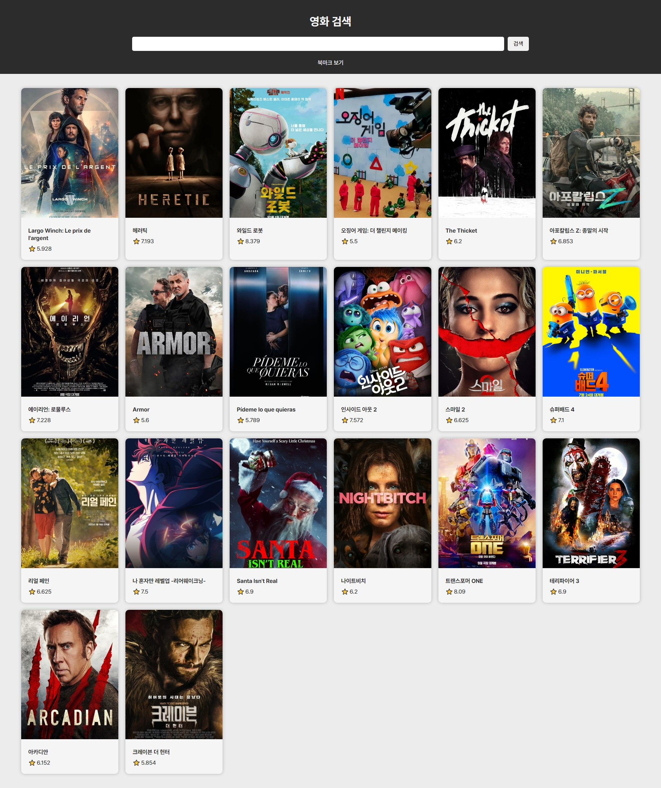

# 🎞 MovieInfo



<br>
<br>

## 💬 프로젝트 소개

: TMDB Open API를 활용한 영화 소개 웹 사이트입니다.

<br>
<br>

## ⚙ 프로젝트 기능 소개

- jQuery 라이브러리 사용 없이 🍦 바닐라 자바스크립트로 구성된 프로젝트입니다.
- TMDB Open API를 이용하여 인기 영화 데이터를 활용했습니다.
- 실시간 데이터를 이용해 카드 UI를 구성했습니다.
<!-- - 북마크 기능을 통해 유저가 표시한 영화를 모아 볼 수 있도록 구현했습니다. -->

<br>
<br>

## 🚀 트러블 슈팅

- ### [[영화 상세 모달] 모달 클릭 이벤트 에러 : 안전한 이벤트 위임 처리](https://velog.io/@jiyunk/트러블슈팅-모달-클릭-이벤트-에러-안전한-이벤트-위임-처리)

<br>
<br>

## 📁 프로젝트 구조

```markdown
📁
|- css/
|   |- font.css
|   |- normalize.css
|   |- style.css  
|
|- js/
|   |- script.js
|  
|- index.html
```
